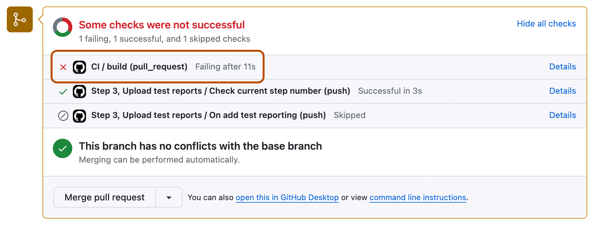

## Step 1: Add a test workflow

_Let's get started! :rocket:_

**What are workflows?** A workflow is a complete unit of automation, defined from start to finish. It includes the definition of what triggers the automation, what environment or other aspects should be taken into account during the automation, and what should happen as a result of the trigger.


### Workflow terminology

- **Job**: A job is a section of the workflow. A workflow can have one or more jobs. Each job can have one or more steps. In the example above, the job is called `build` and contains a single step.
- **Step**: A step represents one _effect_ of the automation. Each step is defined within a `steps` section in the workflow. A step can be a shell script, or a reference to an action that's defined elsewhere. Each step performs one or more operations - for example, printing something to the workflow log.
- **Action**: An action (with a lowercase "a") is a piece of automation written in a way that's compatible with workflows. The actions you reference in a workflow can be written by GitHub, by the open source community, or you can write them yourself!

To learn more, see "[Workflow syntax for GitHub Actions](https://docs.github.com/actions/using-workflows/workflow-syntax-for-github-actions)."

First, let's add a workflow to lint (that is, clean, like a lint roller) our Markdown files in this repository.

### :keyboard: Activity: Add a test workflow

1. Open a new browser tab, and navigate to this same repository. Then work through the following steps in that browser tab while you read the instructions in this tab.
1. Go to the **Actions tab**.
1. Click **New workflow** to display a list of workflow templates.
1. In the "Simple workflow by GitHub" template box and click **Configure**.

   If the "Simple workflow by GitHub" template isn't displayed, use the search field to find it.

1. At the top of the workflow editor, change the name of the workflow file from `blank.yml` to `ci.yml`.

   **Note**: For the purposes of this course, it's important to use the exact file names and branch names specified in the instructions.

1. Update the workflow by deleting the last two steps.
1. Add the following step at the end of your workflow:

   ```yaml
   - name: Run markdown lint
     run: |
       npm install remark-cli remark-preset-lint-consistent
       npx remark . --use remark-preset-lint-consistent --frail
   ```

1. Adjust the indentation of these lines in the workflow file, so that this workflow step is aligned with the first step in the `steps` section of the file. When it is aligned correctly there will be no red squiggly lines indicating errors.

   **Tip**: You can select all four lines of the step and use the <kbd>Tab</kbd> key to adjust the indentation.

1. Click **Commit changes**, choose the "Create a new branch for this commit and start a pull request" option and call the new branch `ci`.
1. Click **Propose changes**.
1. Click **Create pull request**.
1. Wait for a few seconds for the "CI / build (pull_request)" check to be displayed on the pull request.

   The merge box on the pull request displays the status of the most recently run workflow jobs.

   Each job will be marked as "Queued" and then "In progress." When a job finishes, icons to the left of the job name will indicate whether the job completed successfully (a green check mark), failed (a red cross), or skipped (a grey forward slash).

   The "CI / build (pull_request)" job will start running and will then fail. This is expected. 🙂

   

   The text "CI / build (pull_request)" indicates that a job called "build" in a workflow called "CI" was run by a pull request event. In the screenshot above, the merge box also lists other jobs that were run by another workflow in this repository.

   **Note**: If the checks don't appear or if the checks are stuck in progress, there's a few things you can do to try and trigger them:

   - Refresh the page. It's possible the workflow ran and the page just hasn't been updated with that change.
   - From the **Files changed** tab of the pull request, edit the workflow file and ensure there are no red squiggly lines indicating a syntax problem.
   - Edit the workflow file and commit a small change - for example, change one of the comments slightly. The workflow is triggered by a `push` event, so committing to the `ci` branch of your pull request will cause the workflow job to run again.

1. Add a comment to your pull request containing the text: "The linter check is failing."
1. Wait about 20 seconds and then refresh the page you're reading now (the README for the repository on the `main` branch).

   A separate Actions workflow in the repository (not the workflow you created) will run and will automatically replace the contents of this README file with instructions for the next step.
