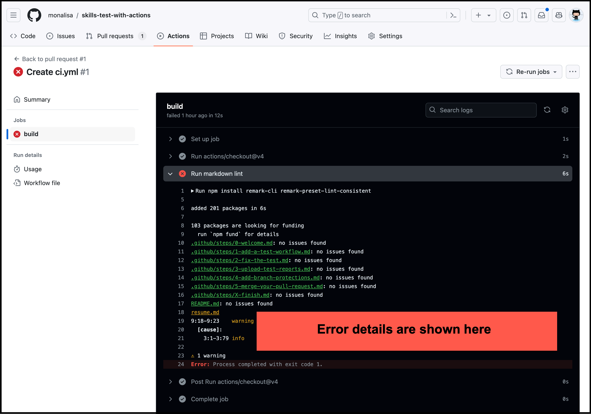

## Step 2: Fix the test failure

_Great job creating a workflow based on a template! :tada:_

The workflow you created contained one job, which installed and ran a linter. This checks for errors in all of the Markdown files in the repository, and logs details of all of the files that were checked. If any errors are found, the job fails.

Let's find out what's causing this test to fail on your pull request and fix the problem.

### :keyboard: Activity: Fix the problem

After the workflow jobs for a pull request have completed, you can find out what happened by looking at the log for each job.

1. On your pull request, click **Details** beside the failing job.

   The log for the "build" job is displayed, with the section for the "Run markdown lint" step expanded to show the details of the linter run.

   

1. Look for the error warning in the log. Identify the Markdown file and line number that contains the error, and find out what the error is.
1. Click the **Code** tab of your repository, then click the branch dropdown and select the `ci` branch.
1. Open the Markdown file that contains the error, and edit the file to fix the error.
1. Commit your change directly to the `ci` branch.
1. Display your pull request again, and wait for your workflow to run again. The job should now pass.
1. Merge your pull request.
1. Wait about 20 seconds and then refresh this page (the one you're following instructions from). [GitHub Actions](https://docs.github.com/actions) will automatically update to the next step.
