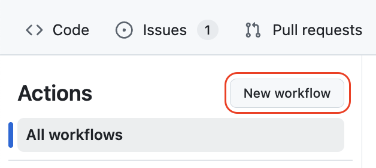
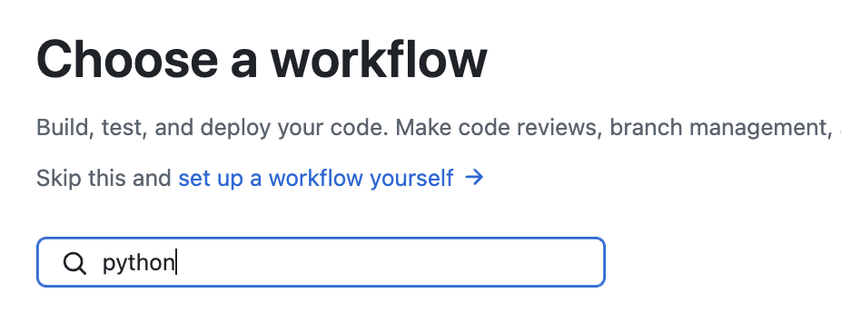
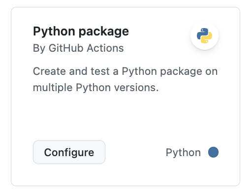
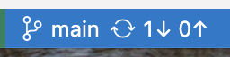

## Step 2: Workflow files

The best way to add automation to your project's repository is with a GitHub Actions Workflow. Let's look at the anatomy of a workflow then create 2 of them.

### What are the parts of workflow?


- **Workflow**: A unit of automation from start to finish. It begins when the trigger (`on`) matches an activity in the repository. It consists of 1 or more jobs.

- **Jobs**: The workflow's jobs each run in their own isolated environments and can be configured differently. They run in parallel unless configured otherwise or dependencies are set.

- **Steps**: The steps area is a series of related actions that achieve a job's goal. A step can be a pre-made _Action_ from the Actions Marketplace, a private Action, a local custom script, or even direct code.

- **Action**: Each step is an _Action_, a piece of automation written in a way that is compatible with workflows. Actions can be written by GitHub, by the open source community, or specific to the project.

In the above `Example Workflow` file, it will start when any commits are pushed to the repository on any branch. It will run 1 job with the name `build`. That job's first step uses a pre-made _Action_ from the `actions` organization named `checkout` that clones the code from the repository into the job's environment.

You can explore all of the configuration options in the [GitHub Actions Docs](https://docs.github.com/actions/using-workflows/workflow-syntax-for-github-actions).

### ⌨️ Activity: Add a workflow to run tests

1. Open a web browser tab and navigate to this exercise repository. The Codespace is not needed right now.

1. In the top navigation, select the **Actions** tab.

1. In the left navigation, above list of workflows, click the **New workflow** button.

   

1. Enter `python` into the search box and click the **Enter** button.

   

1. Find the **Python package** workflow and click the **Configure** button to open a file editor with a pre-made workflow.

   

1. Around line 6, simplify the `on` trigger. Remove the `push` trigger and keep the `pull_request` trigger.

   ```yml
   on:
     pull_request:
       branches: ["main"]
   ```

1. Around line 38, change the command to show more details in the logs.

   ```yml
   - name: Test with pytest
     run: |
       pytest --verbose
   ```

1. Above the editor, on the right, click the **Commit changes...** button. Commit directly to the `main` branch.

<details>
<summary>Having trouble? 🤷‍♂️</summary>

Indention of `.yml` files is important. If you are getting syntax errors, that may be the reason.

Finished workflow file: `.github/workflows/python-package.yml.example`

</details>

### ⌨️ Activity: Add a workflow to show test coverage

1. Switch to the VS Code Codespace.

1. Check the status bar for a pending update. Click it to pull your recently committed workflow.

   

1. In the left navigation, select the **Explorer** tab to show the project files.

1. Expand the `.github/workflows/` folder.

1. Add a new file with the following name and open it.

   ```txt
   python-coverage.yml
   ```

1. Enter the name and set it to trigger on pull requests targeting the `main` branch.

   ```yml
   name: Python Coverage

   on:
     pull_request:
       branches:
         - main

   permissions:
     pull-requests: write
   ```

1. Add the `python-coverage` job and a first step that gets the repository content.

   ```yml
   jobs:
     python-coverage:
       runs-on: ubuntu-latest

       steps:
         - name: Checkout code
           uses: actions/checkout@v4
   ```

1. Add steps to install Python and required packages.

   ```yml
   - name: Set up Python
     uses: actions/setup-python@v4
     with:
       python-version: 3.13

   - name: Install dependencies
     run: |
       pip install -r requirements.txt
       pip install pytest==8.4.1
       pip install coverage==7.9
       pip install pytest-cov==6.2.1
   ```

1. Add steps to run the coverage report on the `src` folder.

   ```yml
   - name: Run tests and generate coverage details
     run: pytest --cov=src
   ```

1. Add a final step that uses a pre-made GitHub Action to share the coverage report as a comment on the pull request.

   

   ```yml
   - name: Coverage comment
     uses: py-cov-action/python-coverage-comment-action@v3
     with:
       GITHUB_TOKEN: ${{ github.token }}
       MINIMUM_GREEN: 90
       MINIMUM_ORANGE: 70

   - name: Fail if below threshold
     run: coverage report --fail-under=90
   ```

   

1. Commit and push the changes to your `python-coverage.yml` file to the `main` branch.

1. With both new workflows pushed to GitHub, Mona will review your work and post the next steps.

> [!TIP]
> Did you notice the many `uses:` statements? Those are pre-made steps from the free [Actions Marketplace](https://github.com/marketplace?type=actions). Consider trying one of them out before you create your own custom scripts (to maintain)! There are lots of awesome creations from the community!

<details>
<summary>Having trouble? 🤷‍♂️</summary>

Indention of `.yml` files is important. If you are getting syntax errors, that may be the reason.

Finished workflow file: `.github/workflows/python-coverage.yml.example`

</details>
