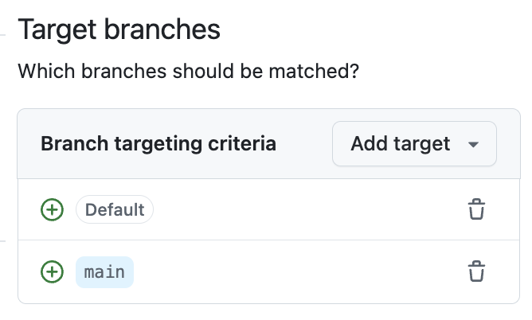
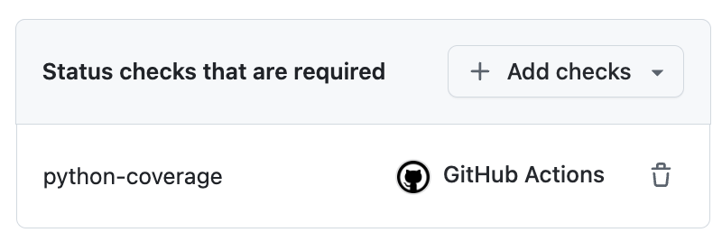
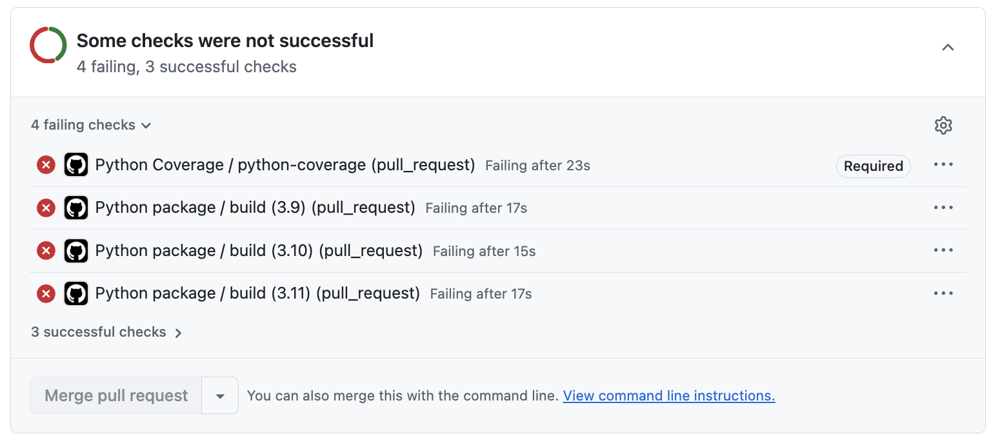
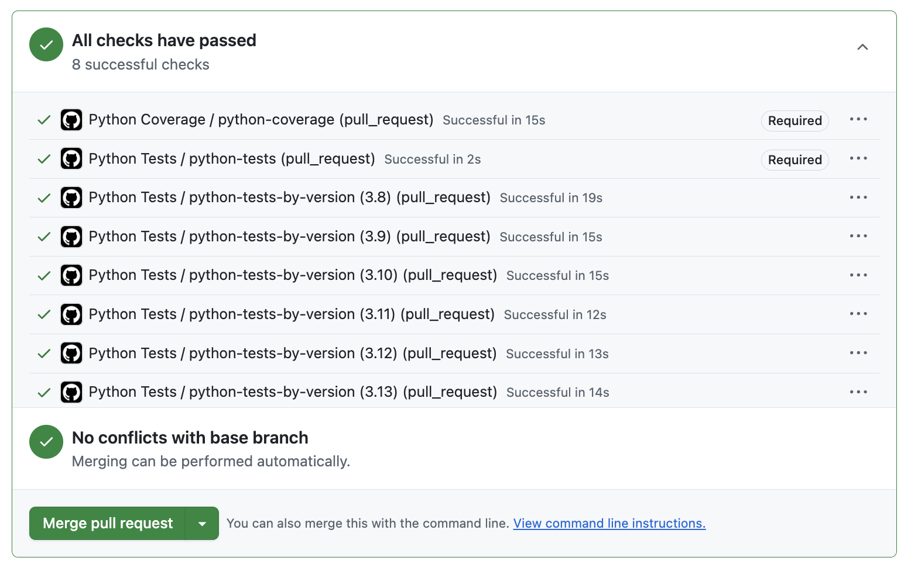

## Step 4: Enforce workflows

You may have noticed that the merge button was still active before our tests finished.
Even worse, the some tests failed and there was nothing to prevent merging the broken code anyway! 😱

Let's fix this to avoid anyone (accidentally) bypassing verification.

### ⌨️ Activity: Add branch protection

1. In the top navigation, select the **Settings** tab.

1. In the left navigation, select **Rules** and choose **Rulesets**.

1. Click the **New ruleset** and select **New branch ruleset**. Use the following settings:

   - **Ruleset Name:** `Protect main`
   - **Enforcement status:** `Active`
   - **Target branches:**
     - **Include default branch**
     - **Include by pattern:** `main`
   - **Require status checks to pass**: ☑️ Checked
     - `python-coverage`

   <br/>

   > 🪧 **Note:** To keep the lesson simple, we are only checking the coverage workflow. Feel free to experiment though!

   

   

1. Click **Create**.

1. Navigate back to the pull request and refresh the page.

1. Scroll to the bottom to find failed workflows and the **Merge** button now disabled! Nice! 🥰

   

> [!TIP]
> Interested to learn more ways to prepare your project for collaboration? Check out the [Introduction to Repository Management](https://github.com/skills/introduction-to-repository-management) exercise next!

### Activity: Fix the broken test

Lets investigate why our testing workflow failed. Is it misconfigured or is some code bac? Maybe there was a reason that test was disabled?!

1. Click on the `Python Coverage` workflow to view the logs. It will automatically navigate to the failed logs.

1. After some inspection, there are 2 issues preventing merging.

   - 1 test is failing.
   - Coverage is below the 90% requirement.

1. Switch to the VS Code Codespace.

1. Open the `tests/calculations_test.py` file.

1. After some investigation, we see the broken test might have been commented out because it was designed incorrectly.

   - A quick google search shows that the 10th entry in the Fibonacci sequence is `55`, not `89`.

1. Change the test to use the correct assert value.

   ```bash
   def test_get_nth_fibonacci_ten():
      """Test with n=10."""
      # Arrange
      n = 10

      # Act
      result = get_nth_fibonacci(n)

      # Assert
      assert result == 55
   ```

1. Commit and push the corrected test code then wait for the workflows to run again.

   - This time the tests pass and we receive a detailed coverage report.

## Activity: Fix low test coverage

With our test corrected, we are now getting coverage results.
Unfortunately it is below the 90% requirement.
Let's add some more tests to increase coverage.

1. Let's ask GitHub Copilot to find missing test cases. Alternately, you can expand the manual steps below.

   > 
   >
   > ```prompt
   > Hey Copilot, the test coverage is too low. Please find the missing tests to get us to 100% coverage.
   > ```

   <details>
   <summary>🪧 <b>Show:</b> Manual steps</summary>

   1. Open the `tests/calculations_test.py` file.

   1. Add the following 2 entries.

      ```py
      def test_area_of_circle_negative_radius():
         """Test with a negative radius to raise ValueError."""
         # Arrange
         radius = -1

         # Act & Assert
         with pytest.raises(ValueError):
            area_of_circle(radius)
      ```

      ```py
      def test_get_nth_fibonacci_negative():
         """Test with a negative number to raise ValueError."""
         # Arrange
         n = -1

         # Act & Assert
         with pytest.raises(ValueError):
            get_nth_fibonacci(n)
      ```

   </details>

1. Commit and push the 2 new tests.

1. Wait a moment for the workflows to run one final time.

   - The coverage comment will update to 100%.
   - The merge button will activate!

1. Click the **Merge** button.

   

1. With full coverage, all tests passing, and the pull request merged, Mona will share a final review. Congrats, you are all done!
